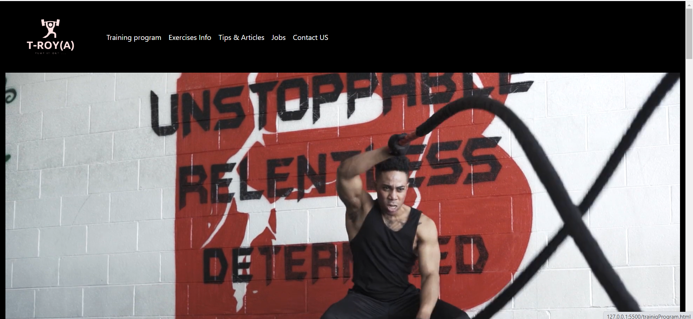

# TROYA-PROJECTTroya
## Descreption
The site introduces the user to gyms around the country, gives him training programs, tips and sample articles. Displays with the help of an API information about various exercises and an option for a more specific search
## Project Flow
* Difficulties:
1. I don't success the option to register on the site.
2. I don't success The option to show the user his training program from the local storage.
3. I don't success to found another API.
4. I had a challenge with the French in the API.
5. The filter function in the API.
* What was goood:
1. Build the function to translate part of the API to english.
2. The main design of the site and the mobile adaptation.
3. Use axios to get API.
4. Build a function that dispaly data And match it to different arrays.

# Design

### Web 

